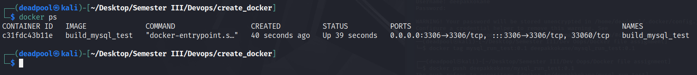

<h1> Docker_mysql   </h1>
 
<h1><pre>               Assignment_II       </pre></h1>

# Dockerfile_Build image with loaded MySQL schema


<h3><b>Docker builds images automatically by reading the instructions from a Dockerfile  text file that contains all commands, in order, needed to build a given image. A Dockerfile adheres to a specific format and set of instructions.
</h3>

## Makefile commands
```
1. make build => builds image from the Dockerfile
2. make run   => create and start container from the built image
3. make exec  => to go inside created container
```

## Getting Started
<h2>

1. Clone the project

2. make build


3. make run


4. Please make sure that container is running successfully by using `docker ps` command


5. make exec


</h2>

## See all Docker images


## Pull image from Dockerhub 


### Requirements
```
Docker
Make
```


